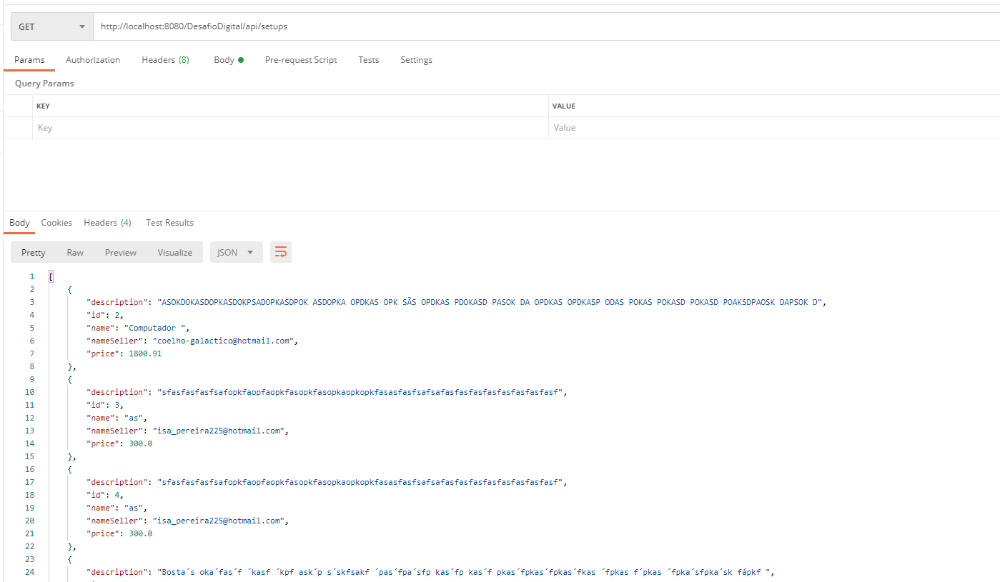
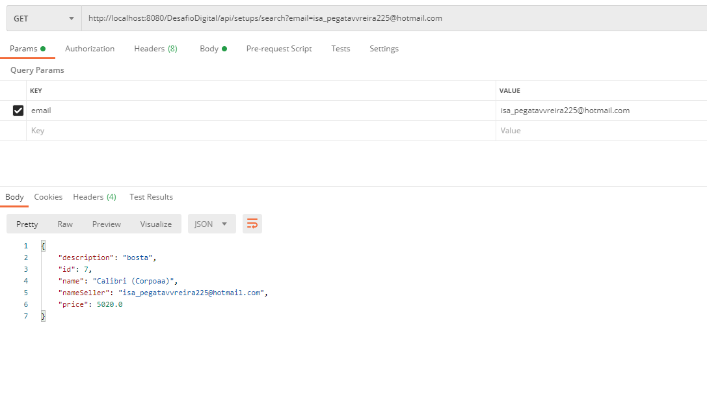
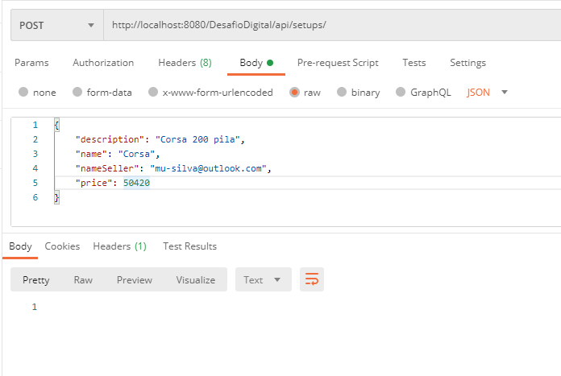
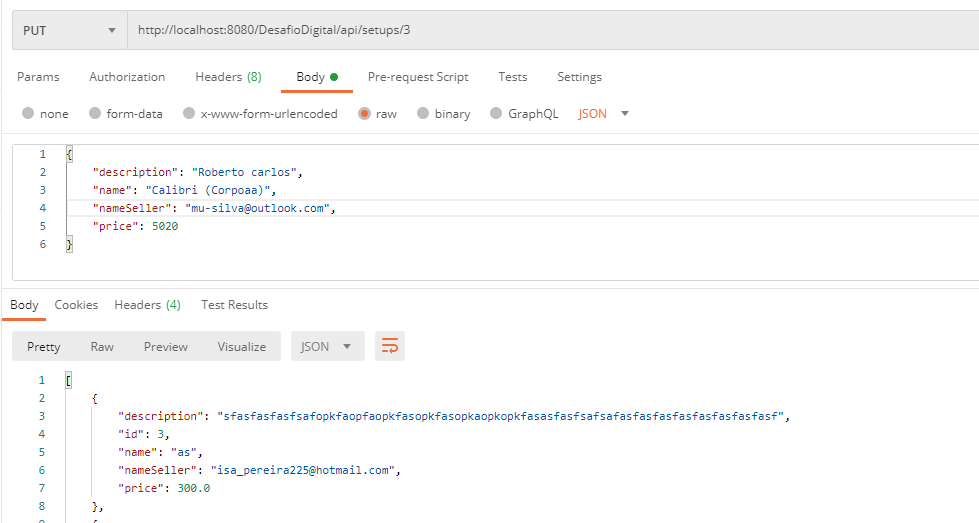
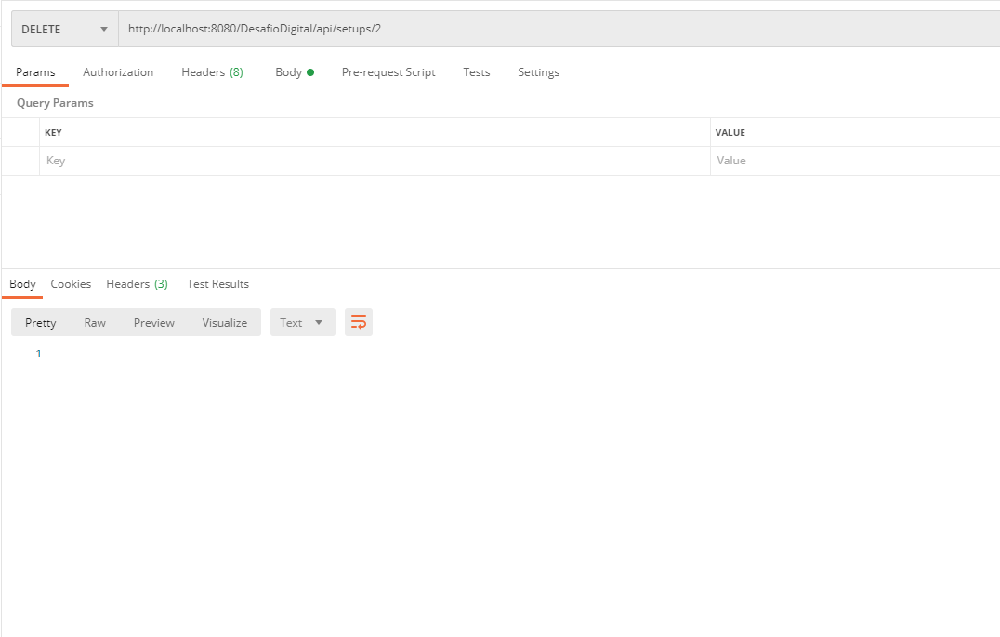

# CHECKPOINT
Desafio proposto em aula

## Usando versão: JBOSS 23.0.0.FINAL1 ##

## PADRÃO: http://localhost:8080/DesafioDigital/login.xhtml ##

## ATUALIZAÇÃO ENTREGA TOTAL ##
- Usar metodo Webservice para acessar API 
## URL API METHOD GET

- Enviando a requisição para acessar endpoint obter todos 
-  http://localhost:8080/DesafioDigital/api/setups/
  

## URL API METHOD GET
- Enviando a requisição para acessar endpoint buscar por email
- http://localhost:8080/DesafioDigital/api/setups/search?email=(email-cadastrado)
  
  
## URL API METHOD POST
- Enviando a requisição para acessar endpoint inserir item
- http://localhost:8080/DesafioDigital/api/setups/ 
  

## URL API METHOD PUT 
- Enviando a requisição para acessar endpoint update, item 3
- http://localhost:8080/DesafioDigital/api/setups/3
  

## URL API METHOD DELETE
- Enviando a requisição para acessar endpoint DELETE, item 2
- http://localhost:8080/DesafioDigital/api/setups/2
  
  

## URL API METHOD GET
- Enviando a requisição para acessar endpoint buscar por id
-  http://localhost:8080/DesafioDigital/api/setups/2
  
